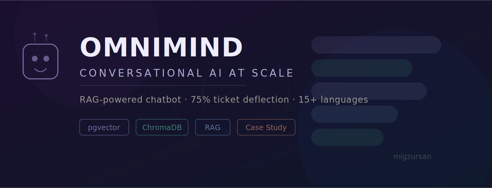
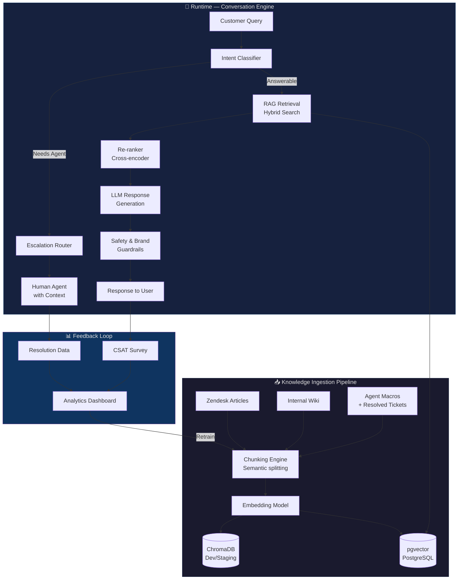

<p align="center">
  
</p>

<h1 align="center">OmniMind — Conversational AI at Scale</h1>

<p align="center">
  <strong>How we built a RAG-powered chatbot that deflected 75% of customer support tickets at Vivino.</strong>
</p>

<p align="center">
  
  
  
  
  
</p>

<p align="center">
  <a href="#context">Context</a> •
  <a href="#problem">Problem</a> •
  <a href="#solution-architecture">Architecture</a> •
  <a href="#results">Results</a> •
  <a href="#lessons-learned">Lessons</a>
</p>

---

> **Note:** This is a product leadership case study, not a code repository. It documents the architecture, decisions, and outcomes of a production AI system I led at Vivino. No proprietary code is included. All diagrams and frameworks are my own.

---

## Context

**Company:** [Vivino](https://www.vivino.com) — the world's largest wine marketplace, 50M+ users.

**My Role:** Global Programme Lead, managing 25+ people across Product Operations, AI strategy, and automation. I owned the end-to-end delivery of OmniMind from concept to production.

**Timeline:** ~6 months from initial PoC to full production deployment.

**The Opportunity:** Customer support was scaling linearly with user growth. Every new market meant more agents, more languages, more cost. We needed support to scale sub-linearly.

---

## Problem

```
                    ┌──────────────────────────┐
                    │   The Scaling Problem     │
                    └──────────┬───────────────┘
                               │
              ┌────────────────┼────────────────┐
              │                │                │
    ┌─────────▼─────┐  ┌──────▼──────┐  ┌──────▼──────┐
    │  Volume        │  │  Languages  │  │  Quality    │
    │  Tickets grew  │  │  15+ langs  │  │  Response   │
    │  linearly with │  │  each needs │  │  times were │
    │  user base     │  │  trained    │  │  increasing │
    │                │  │  agents     │  │             │
    └────────────────┘  └─────────────┘  └─────────────┘
```

Specific challenges:
- **Knowledge fragmentation** — answers were scattered across Zendesk macros, internal wikis, and tribal knowledge in agents' heads
- **No self-service** — the help center existed but users bypassed it because search was poor
- **Language coverage gaps** — some markets had 48h+ response times during peak periods
- **Agent onboarding** — new agents took 3+ weeks to reach competency

---

## Solution Architecture



### Key Design Decisions

| Decision | Options Considered | Choice | Rationale |
|---|---|---|---|
| **Vector DB** | Pinecone, Weaviate, pgvector, ChromaDB | pgvector (prod) + ChromaDB (dev) | pgvector lived in our existing Postgres infra = zero new ops burden. ChromaDB for fast local iteration. |
| **Chunking** | Fixed-size, sentence, semantic | Semantic chunking | Support articles have mixed content (FAQs, how-tos, policy). Semantic boundaries preserved answer coherence. |
| **Retrieval** | Dense only, sparse only, hybrid | Hybrid (dense + BM25) + re-ranking | Dense search missed keyword-heavy queries ("order #12345"). Hybrid + cross-encoder re-ranking caught both semantic and exact matches. |
| **Escalation** | Confidence threshold, classifier, human-in-loop | Intent classifier + confidence threshold | Two-layer safety net. Classifier catches known escalation patterns; threshold catches "I'm not sure" moments. |
| **Guardrails** | Post-hoc filtering, constrained generation | Both — prompt engineering + output filtering | Wine marketplace = need to avoid health claims, legal statements, and off-brand tone. Belt-and-suspenders approach. |

---

## The RAG Pipeline — Deep Dive

### Ingestion

```
Source Documents                    Processed Chunks
┌──────────────┐                   ┌──────────────────────┐
│ "How to      │   Semantic        │ Chunk 1: Return      │
│  return a    │──▶ Splitting ──▶  │  eligibility rules   │
│  wine order  │   + Metadata      │ Chunk 2: Return      │
│  (full       │   Enrichment      │  process steps       │
│   article)"  │                   │ Chunk 3: Refund      │
└──────────────┘                   │  timeline & methods  │
                                   └──────────────────────┘
                                   Each chunk carries:
                                   - source_url
                                   - language
                                   - category
                                   - last_updated
                                   - confidence_tier
```

### Retrieval + Generation

```
User: "I ordered the wrong wine, can I return it?"
                    │
    ┌───────────────▼───────────────┐
    │  Query Embedding + BM25 Index │
    └───────────────┬───────────────┘
                    │
    ┌───────────────▼───────────────┐
    │  Top-K Candidates (k=10)      │
    │  Dense: 6 results             │
    │  Sparse: 4 results            │
    └───────────────┬───────────────┘
                    │
    ┌───────────────▼───────────────┐
    │  Cross-encoder Re-ranking     │
    │  Top 3 selected               │
    └───────────────┬───────────────┘
                    │
    ┌───────────────▼───────────────┐
    │  LLM Prompt:                  │
    │  System: Brand voice + rules  │
    │  Context: [3 chunks]          │
    │  Query: User's question       │
    │  Instruction: Answer using    │
    │  only provided context        │
    └───────────────┬───────────────┘
                    │
    ┌───────────────▼───────────────┐
    │  Output guardrails check      │
    └───────────────┬───────────────┘
                    │
    "Yes! Vivino offers returns within 30 days.
     Here's how to start your return: [steps]..."
```

---

## Results

<table>
  <tr>
    <td align="center"><h2>75%</h2><sub>Ticket Deflection Rate</sub></td>
    <td align="center"><h2>~60%</h2><sub>Reduction in Avg Response Time</sub></td>
    <td align="center"><h2>15+</h2><sub>Languages Supported</sub></td>
  </tr>
  <tr>
    <td align="center"><h2>3→1 wk</h2><sub>Agent Onboarding Time</sub></td>
    <td align="center"><h2>Sub-linear</h2><sub>Support Cost Scaling</sub></td>
    <td align="center"><h2>4.2/5</h2><sub>CSAT on Bot Interactions</sub></td>
  </tr>
</table>

---

## My Role — What I Actually Did

This wasn't a project where I wrote a spec and handed it off. As Global Programme Lead:

**Strategy & Stakeholder Management**
- Built the business case and secured executive buy-in by framing it as a cost-scaling problem, not a "let's add AI" initiative
- Coordinated across Customer Support, Engineering, Data Science, and Product — 4 departments, 25+ people
- Defined success metrics (deflection rate, CSAT, escalation rate) before a single line of code was written

**Technical Leadership**
- Drove the RAG architecture decisions — evaluated vector DB options, chunking strategies, and retrieval patterns
- Designed the feedback loop that continuously improved retrieval quality
- Made the call on hybrid search after dense-only retrieval missed 20% of keyword-heavy queries in testing

**Delivery & Iteration**
- Ran the phased rollout: internal beta → 5% traffic → 25% → 100%
- Established quality gates between phases (minimum CSAT, maximum escalation rate)
- Built the monitoring dashboard that surfaced "low-confidence" responses for human review

---

## Lessons Learned

### 1. Chunking is 70% of RAG quality
We spent 3 weeks on chunking strategy alone. Fixed-size chunks broke answers in half. Sentence-level was too granular. Semantic chunking with metadata enrichment was the breakthrough. If your RAG system is underperforming, look at your chunks before touching anything else.

### 2. Hybrid search is non-negotiable for support
Customers paste order numbers, reference specific products, and use exact phrases from emails they received. Pure semantic search misses these. BM25 + dense + re-ranking was the minimum viable retrieval stack.

### 3. The escalation path IS the product
We spent as much time designing graceful escalation as we did on the happy path. When the bot escalates, it passes full context to the human agent. Users never have to repeat themselves. This single feature drove more CSAT improvement than the bot's answer quality.

### 4. Start with the feedback loop, not the model
We had a feedback loop capturing low-confidence responses and agent corrections from week 1 of the beta. This data was more valuable than any pre-launch tuning. Ship fast, learn fast.

### What I'd Do Differently
- **Invest in evaluation harnesses earlier.** We were manually spot-checking responses for too long before building automated evals.
- **Build a "confidence explainer" for agents.** When the bot escalated, agents couldn't see *why* — they just got the context. Knowing the bot's confidence score and retrieved chunks would have helped them respond faster.
- **Multi-turn from the start.** V1 was single-turn Q&A. Users expected follow-ups. We retrofitted multi-turn, which was harder than building it in from day one.

---

## Related Projects

- [Sancho Voice Agent](https://github.com/migzursan/sancho-voice-agent) — My personal AI assistant applying these same patterns locally
- [Checkout Optimization Case Study](https://github.com/migzursan/checkout-optimization-case-study) — Fraud detection + payment expansion at Vivino
- [migzursan.github.io](https://migzursan.github.io) — Full portfolio

---

<p align="center">
  Built by <a href="https://migzursan.github.io">Miguel Zurbano</a> · Global Programme Lead · AI & Product
</p>
